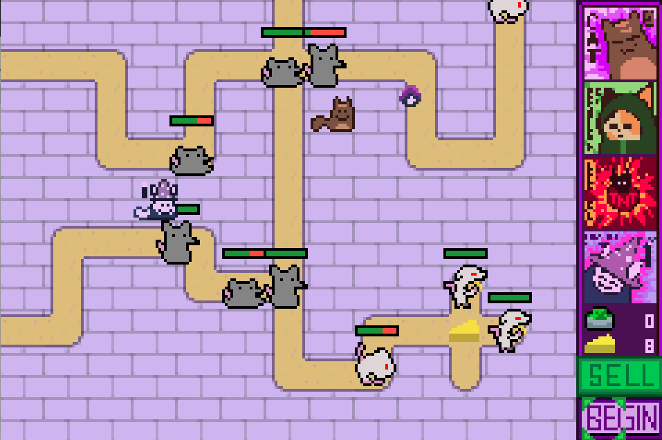
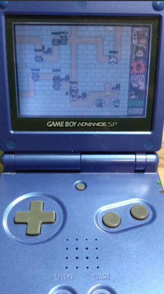

# Cats vs. Rats GBA Edition

See https://github.com/walkingeyerobot/pokeemerald/wiki/wsl2-and-vscode-setup for development environment info

// TODO: Remove rat sprite / HP bar when rat runs out of health  
// TODO: Add way to sell cats, removing their sprites and adding cash  
// TODO: Add rat mutations  
// TODO: Change target when target dies, or remove projectile when target dies  

// TODO: Add 'begin' button functionality, adding in-between rounds  
// TODO: Add win/lose screens  
// TODO: Add main menu  
